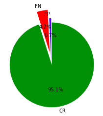

# Affiliations (Persian Papers)

This is part of "Metadata extraction project" with these approaches:

  - Extract affiliations (like university and degree)
  - Extract email addresses of papers authors
  - Release extracted informations in JSON files to integrate with other parts of this project

> The main idea is to search and find "affiliation-related words"
> in persian, like "دانشگاه" or "استاد" or etc.
> I've used RE library for the second part (emails).
> And finally the last part has solved by json library.

### Functions

| name | returns |
| ------ | ------ |
| find_abstract_index | index of word in sentence OR nothing |
| cosine_sim | cosine similarity of two strings |
| count_affiliation_related_words | how much is a sentence related to affiliation |

### Results
By considering 10 articles, an accuracy of 95.09 was obtained.

